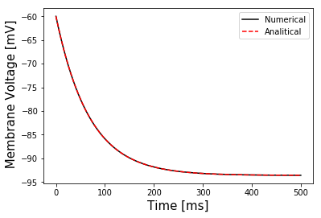
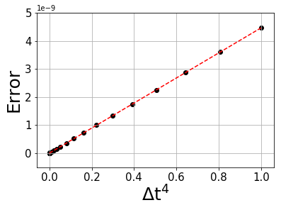

# MORRIS-LECAR MODEL 

Analysis of Bifurcation in the Morris Lecar Model.

Project for 'Models and Numerical Methods for Applied Physics'.

## RungeKutta

The folder contains all the codes about the implementation of the 4th order Runge-Kutta algorithm used to integrate the system of differential equations that represents the Morris-Lecar model. 

In particular, you should find the following files
* **rk4.py**: it contains the Runge-Kutta algorithm to solve one differential equation;
* **error_rk4.py**: it contains the analysis of the global truncation error introduced by the algorithm;
* **rk4_system.py**: it contains the Runge-Kutta algorithm to solve a set of two differential equations.

### rk4.py

The program **rk4.py** contains the implementation of the 4th order Runge-Kutta algorithm to solve one differential equation (source: <https://rosettacode.org/wiki/Runge-Kutta_method>).
The algorithm aims to solve differential equations written as dy/dt = f(t,y).
  
To call the algorithm, you should follow the following example:
  ```
  import numpy as np
  def f(t,y):
    return t*np.sqrt(y)
  t, y = RK4(f, dt=0.01, y0=1.0, t0=0.0, Nstep=1000)
  ```

**Parameters:**
* **f(t,y)**: is a function that may depend both on y and t;
* **dt**: is the integration time step;
* **y0**: is the initial condition;
* **t0**: is the initial time;
* **Nstep**: is the number of steps for which the algorithm must be repeated

**Return Value:**
* **t**: it is a float64 array of size *Nstep*
* **y**: it is a float64 array of size *Nstep* that represents the solution of the differential equation
  
The program **rk4.py** also contains two tests:

The **first test** applies the algorithm forward and backward in time (in both cases the algorithm is repeated *Nstep* times) to a test function 
  
  ```
  import numpy as np
  f(t,y) = t*np.sqrt(y)
  ```
  and checks if the final value is equal to the initial one within a certain tolerance on precision governed by the parameter tol (set at tol=1e-6);
  
The **second test** applies the algorith three times: the first time the algorithm is applied to go from an initial time value A to B and then to go from B to C; then the algorithm is applied to go directly from A to C. The test function is again
  
  ```
  f(t,y) = t*np.sqrt(y)
  ```
  
The test checks if the final point of the algorithm applied A -> B and B -> C is equal to the algorithm applied directly A -> C within a certain tolerance on precision governed by the parameter tol (set at tol=1e-6).  

**Note on the tests**: the two tests correctly work because an appropriate integration step dt has been set. See the file **rk4_error.py** for further details on the dependance of the error of the algorithm with respect to the integration step.

### error_rk4.py

The program **error_rk4.py** contains the analysis of the error of the algorithm implemented in **rk4.py**. As known from literature (see for example <https://en.wikipedia.org/wiki/Runge–Kutta_methods>), the global truncation error (or total accumulated error) should go as the 4th power ot the integration step: error ~ O(dt<sup>4</sup>).

The first part of the program contains the algorithm implemented in **rk4.py** (see the previous paragraph for further information about the algorithm). 

The second part introduces a test differential equation, deriving from the passive cell membrane model. The model and the parameters come from INGALLS P., *Mathematical Modeling in Systems Biology. An Introduction*, MIT Press (2013).
A first plot shows the difference between the numerical and the analitical solution with the following parameters:

  ```
  g = 0.0144; C = 0.98; E = -93.6; 
  dt = 0.1; v0 = -60.0; t0 = 0.0; Nstep = 5000
  ```
The plot is shown here:



The last part of the file contains the **error analysis** of the algorithm: the Runge Kutta algorithm is applied to the passive cell membrane model several times and the only parameter that is changing is the time step **dt**. We set a parameter **total_time** so that every simulation reach the same point. At the final step, the global truncation error is calculated. 
We registed the time step **dt** and the **global truncation error** and we show the results in a plot, where we also fit the error with a linear model: error ~ O(dt<sup>4</sup>). The results are shown above.



The linear behaviour in the plot shows a correct behaviour of the algorithm.

### rk4_system.py
