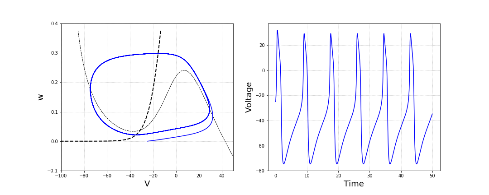
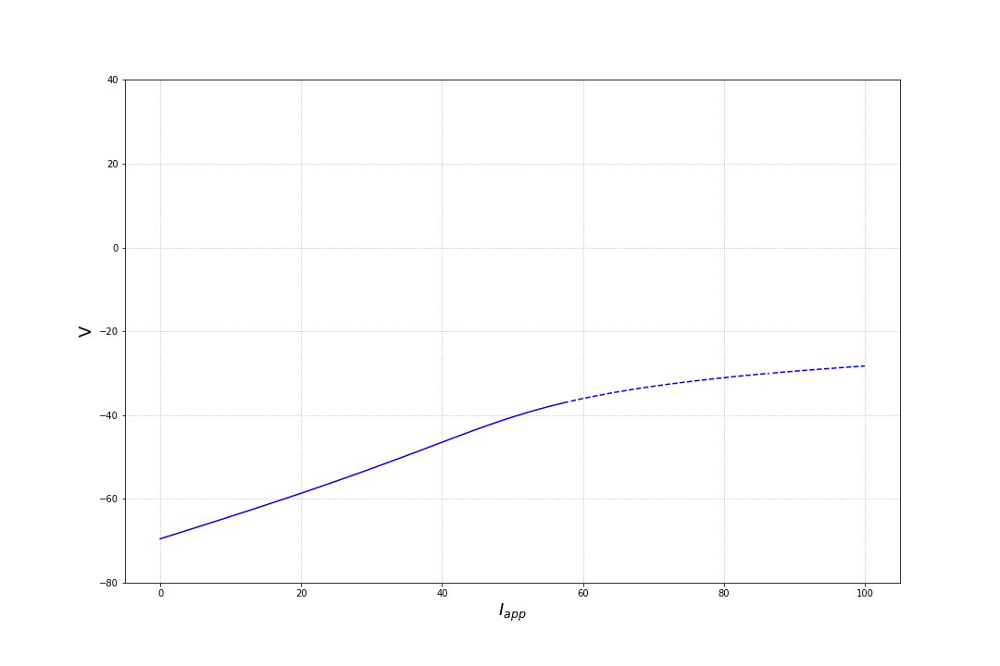
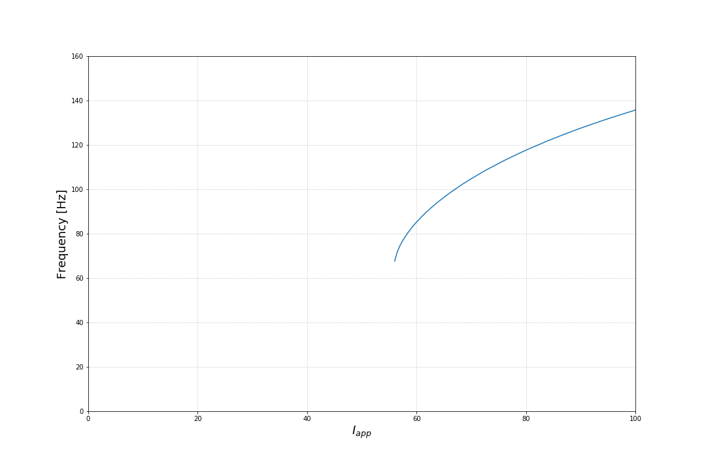

# EXAMPLE

In this folder, an example is given about how to obtain the outcomes 
of the integration of the Morris Lecar model, about the bifurcation analysis
and the frequency plot. The parameters of the model are set 
as shown in the main paper and can be changed in the file having
the following path: `morris/MorrisLecar/fixed_parameters.py`. 

The only parameter of the model to be defined is the parameter `v_ca`. As
discussed in the main paper, this parameter can discriminate between neurons
of class 1, class 2 and class 3. In the present folder, we fix `v_ca=0.0`,
meaning that we are reproducing data relative to class 2 neurons. 

## Integration of the Model

To integrate the model and to obtain the solution (i.e. the time evolution of voltage) 
and the phase space of the integration, type from the present directory

`python ../MorrisLecar/integrate.py --v_ca 0.0 --I_app 80.0 --dt 0.01 --Nstep 5000 --v0 -25.0 --w0 0.0 --out test_int`

We give here a brief description of the parameters that must be parsed to the script. 
The first two parameters are part of the model and are the parameters over which
bifurcation analysis will be performed:
* `--v_ca`: the parameter of the morris lecar model that discriminated between classes of neurons
* `--I_app`: the external current applied to the model
The other parameters are computational parameters:
* `--dt`: time step of integration
* `--Nstep`: total number of steps to be performed
* `--v0`: initial condition on voltage
* `--w0`: initial condition on the fraction of opened channels
* `--out`: name of the generated figure

A figure `test_int.png` is created as output.

## Bifurcation Analysis

To perform bifurcation analysis of the model, type from the present directory

`python ../MorrisLecar/bifurcation_analysis.py --v_ca 0.0 --Imin 0 --Imax 100 --v0min -80 --v0max 40 --out test_bif`

We give here a brief description of the parameters to be parsed:
* `--v_ca`: the parameter of the morris lecar model that discriminated between classes of neurons
* `--Imin`: the minimum value of the applied current
* `--Imax`: the maximum value of the applied current
* `--v0min`: the minimum value of the initial condition on voltage
* `--v0max`: the maximum value of the initial condition on voltage7
* `--out`: name of the generated figure

Notice that when you run the previous script, several errors may be generated: this is due to 
the fact that the Newton algorithm may find an exception (the determinant of the jacobian is 
zero or the maximum number of iterations has been reached). 
Such errors are printed in order to be the user aware of the fact that for some values of 
I_app and/or v0, the newton algorithm does not converge. 
However, in the bifurcation analysis, such points are not considered.
Further information about this behaviout can be exploited in the folder `newton` that implements and tests the algorithm. 

A figure `test_bif.png` is generated and saved as output.

## Frequency Plot

In order to generate the frequency plot, type from the present directory

`python ../MorrisLecar/frequency_plot.py --v_ca 0.0 --dt 0.01 --Nstep 5000 --v0 -25.0 --w0 0.0 --Imin 0 --Imax 100 --out test_freq`

We give here a brief description of the parameters:
* `--v_ca`: the parameter of the morris lecar model that discriminated between classes of neurons
* `--dt`: time step of integration
* `--Nstep`: total number of steps to be performed
* `--v0`: initial condition on voltage
* `--w0`: initial condition on the fraction of opened channels
* `--Imin`: the minimum value of the applied current
* `--Imax`: the maximum value of the applied current
* `--out`: name of the generated figure

A figure `test_freq.png` is generated as output. 

